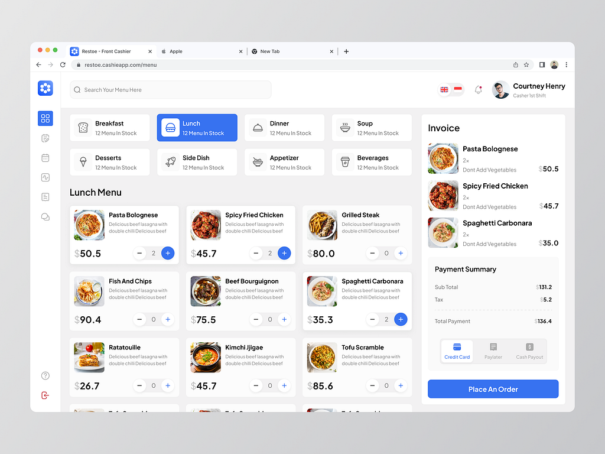

# Open Source Point of Sale (POS) System

Welcome to our **free and open-source Point of Sale (POS)** system, designed to deliver a seamless and efficient retail experience. This real-time, multi-tenant application is built with **Django** and **Vue.js**, providing scalability, security, and performance for businesses of all sizes.

## 🌐 Project Structure

This repository consists of two main directories:

- `backend/` – Django-based API and business logic (runs on **port 7731**).
- `webapp/` – Vue.js frontend (can run on **any available port**).

## ✨ Key Features

- **Multi-Tenant Support**: Manage multiple stores or franchises from a single system. Each tenant’s data is isolated and secured.
- **Real-Time Operations**: Live transaction processing and inventory synchronization.
- **Fiscalized Receipts**: Generate compliant receipts to meet regional fiscal requirements.
- **Elegant UI/UX**: Clean, responsive, and intuitive design that minimizes training and maximizes productivity.
- **Double Entry Accounting**: Full support for double entry bookkeeping — every transaction has a corresponding debit and credit.
- **Integrated Financial Reports**: Automatically generate key financial reports such as income statements, trial balances, and ledgers.
- **Modular General Ledger System**:
  - Business GL accounts
  - Multi-inventory GLs
  - Cash-in-hand GLs
  - Bank and POS transaction GLs
  - Cash/bank payment records

## 🛠 Technical Highlights

- **Django Backend**:
  - RESTful API
  - PostgreSQL (recommended) or any other supported DB
  - Authentication and multi-tenancy middleware
  - Financial report generation
- **Vue.js Frontend**:
  - Modern SPA (Single Page Application)
  - State management with Vuex
  - Responsive layout compatible with mobile/tablet/desktop

## 🖥 UI Preview



## 👥 Contributors

| Name                      | Role                 |
|---------------------------|----------------------|
| Glen Chiridza             | Backend Developer    |
| Ryan Ben                  | Fullstack Developer  |
| Lameck Matenga            | Testing              |
| Munyaradzi Chigangawa     | Frontend Developer   |
| Kundai "Stcheriz" Kachale | Accountant           |
| Alfred Gomo               | Accountant           |

## 📦 Getting Started

### 1. Clone the Repository

```bash
git clone https://github.com/yourusername/pos-system.git
cd pos-system
cd backend
python -m venv venv
source venv/bin/activate  # or venv\Scripts\activate on Windows
pip install -r requirements.txt

# Set environment variables or create a .env file

# Apply migrations and run on port 7731
python manage.py migrate
python manage.py runserver 0.0.0.0:7731
cd webapp
npm install
npm run serve
